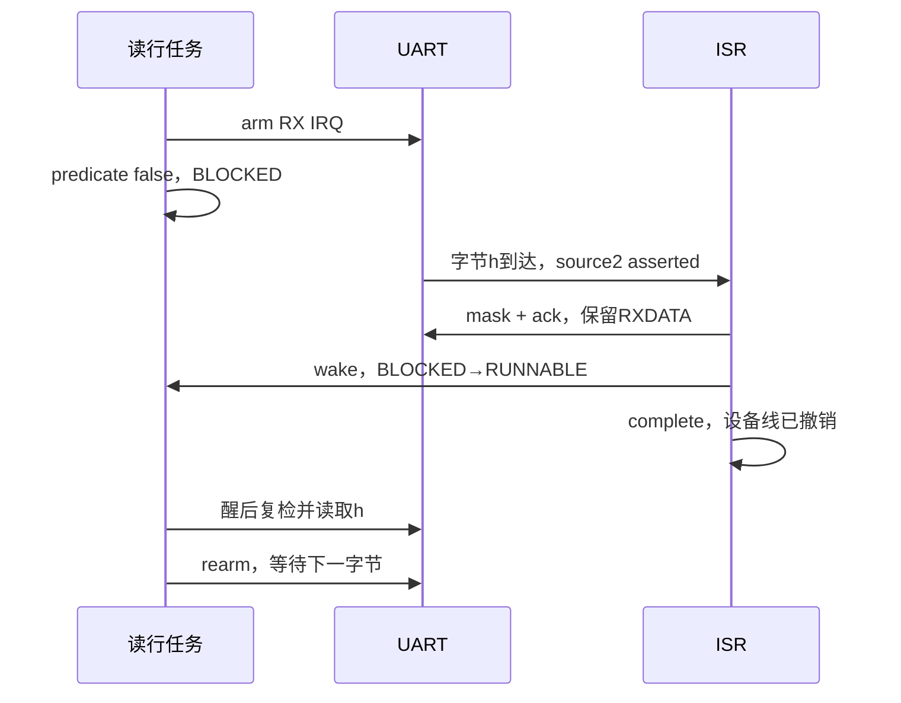

# 0022：Guest 终端文件操作

> 状态：**Spec Lock**（2026-10-03 20:02 +08:00）。项目所有者明确批准整体方案并授权继续实现；实现与验证已完成，交付待用户审查。改变外部行为或不变量须重新走 INTENTION / SPEC / IMPLE 审核，已批准范围内的接口字段与工程细节由实现分批确定。

## INTENTION

在生产 Guest 中输入命令，查看和修改已有 YanFS 镜像。一行输入对应一条命令；写命令先收齐并验证整行，再调用整文件 API。应用拥有独立构建入口，运行不依赖测试目录。

依托 [UART](0015-uart-device.md)、[控制台](0017-console-and-os-layout.md)、[协作式运行时](0019-cooperative-runtime.md)、[持久化镜像](0020-persistent-block-image.md) 和 [YanFS](0021-yanfs.md)。本阶段扩充0019的UART source2服务，新增独立中断读行层；0017的旧console接口、轮询getline及已有测试保留。0015设备语义、块协议、0020失败契约和0021文件系统格式不变，旧规格历史原文不改。

## SPEC

### 命令

| 命令 | 行为 |
| --- | --- |
| help | 显示命令和输入限制 |
| ls | 按目录slot顺序列出文件名和字节数 |
| stat NAME | 显示已有文件字节数 |
| cat NAME | 分块读取整个文件，以本节规则显示内容 |
| create NAME [TEXT] | 仅创建；重名返回EXISTS |
| write NAME [TEXT] | 仅整文件覆盖；不存在返回NOT_FOUND |
| rm NAME | 删除并回收空间，不擦除数据 |
| exit | 健康会话正常结束当前Guest应用 |

命令区分大小写，以ASCII空格分隔。名称沿0021：1–31字节 `[A-Za-z0-9._-]`，拒绝恰好为`.`或`..`。不解释引号、反斜线、变量、路径或重定向。无参数命令允许行首/行尾空格；stat/cat/rm必须恰有一个名称，多余参数拒绝。

create/write在名称后消耗一个空格，其后全部字节是TEXT，保留额外空格和尾空格。名称后没有分隔符或其后为空，表示0字节文件内容。不添加LF。文件内容按原始字节保存，不验证或规范化UTF-8。`create hello.txt hello` 保存5字节；`write hello.txt  world ` 保存7字节，包括一个前导空格和一个尾空格。

行上限1023字节，另留一个NUL；包括命令、分隔符、名称和内容，按字节计数。NUL不进入文件。写命令只调用一次create/replace，不分批发布内容。

### 输入行

CR或LF结束一行；CR后的一个LF跨读行调用吞掉。空行重新提示。BS/DEL按字节删除末字节，不做Unicode字符或显示宽度编辑。0x80–0xFF按原始字节接收和回显；退格可能破坏UTF-8，保存的字节不自动修复。

超过1023字节，或遇到不支持的C0控制字节（包括NUL、ESC、TAB），立即把整行标为拒绝；持续消费到行尾，再报告一次错误。被拒绝后退格不能恢复这一行，已收前缀不得执行。控制字符两侧的内容不能被静默拼接成命令。

缓冲由静态或调用者长期持有的context提供，不把1024字节行或4096字节FS块放入4KiB任务栈。回显、提示和结果输出一旦失败，停止应用；尚未完成的输入行不执行。输入高位字节原样回显不代表任意字节的整个终端交互都经过安全过滤。

### 中断读行与设备所有权

新增独立读行接口，不修改0017的console.h、console.c或getline语义。新读行器独占RXDATA消费和RX_IRQ_ENABLE；应用不能同时使用旧getline或第二个UART consumer。操作期间context有效；同实例重入或第二个owner返回BUSY，不抢占现有waiter。FS adapter仍独占transport。

UART中断线为 `RX_READY && RX_IRQ_ENABLE`，IRQ_STATUS是到达锁存。只W1C清锁存不能撤线。task.c新增source2服务：**mask RX_IRQ_ENABLE → ack锁存 → wake(UART) → PLIC complete**。ISR保留RXDATA，不读取字节，不调度；source1仍按既有transport路径服务，其他未服务源仍panic。

读行器消费字节后重新arm RX_IRQ_ENABLE，用只读、短predicate检查 `RX_READY || !CONNECTED`，未就绪调用task_wait(UART)，醒后重新检查。ready快路径读取前也mask；返回、失败和关闭时mask并ack。predicate、waiter发布、BLOCKED状态变化沿0019的关中断窗口，保持lost-wakeup保证。不添加FIFO、新runtime ABI或Device行为。

Host每256条Guest指令尝试供一个字节；RX_READY时不继续读stdin。读行任务未就绪时BLOCKED，其他RUNNABLE任务可以推进。全部任务BLOCKED时仍沿0019空闲循环消耗CPU和模拟步数，没有WFI。

设备断开不会主动产生新的中断，已BLOCKED任务不能保证立即发现断开。stdin EOF仅使Host停止供字节，Guest看不到EOF，不能据此自动退出。正常会话必须输入exit，不添加输入deadline。

### cat 的字节显示

ASCII可打印字节原样输出，反斜线显示为两个反斜线。C0和DEL按原始字节显示为 `\xHH`，十六进制为大写，不直接发送这些控制字节。

合法UTF-8序列原样输出，U+0080–U+009F的C1控制码例外，按其编码逐字节转义。孤立续字节、overlong、surrogate、超过U+10FFFF和最终截断序列逐字节转义；错误后重新检查后续字节，不能丢字节。流式decoder跨读取边界最多保留一个4字节序列。中文可以直接阅读；单独0x9B显示为 `\x9B`，U+009B编码C2 9B显示为 `\xC2\x9B`。

这保证指定控制字节不会通过cat裸发，不承诺完整Unicode编辑、宽度、规范化或所有不可见字符过滤。cat使用固定小缓冲与offset分块读取；失败前已显示的前缀保留，不能输出完整成功尾标记。

### 输出与错误

使用CRLF作为应用输出行尾，提示符为 `yanfs> `。普通成功以 `OK COMMAND\r\n` 确认，失败以 `ERROR TOKEN\r\n` 与稳定错误名称报告。ls/stat每条文件信息为 `SIZE NAME\r\n`，SIZE是十进制字节数；成功后分别输出 `OK ls\r\n`、`OK stat\r\n`。cat正文后输出 `\r\nOK cat\r\n`，空文件也有明确完成确认；读失败若已有正文先分行再报告ERROR，不打印成功尾。help列出语法、1023字节限制、显式exit和内容显示规则，最后输出 `OK help\r\n`。未知命令为UNKNOWN_COMMAND，参数不符为USAGE，拒绝行为LINE_TOO_LONG或INVALID_INPUT；FS错误沿其公开enum名称。

INVALID、EXISTS、NOT_FOUND、DIRECTORY_FULL、NOSPACE等普通错误报告后继续；BUSY不夺取实例。挂载失败、实际IO/PROTOCOL、FS FAULTED或输出失败立即终止，不继续收命令等待exit。不自动格式化、修复、重试写或重挂。

整行验证发生在FS调用前；FS成功后才打印成功。若发布目录后输出失败，文件可能已改变，不能宣称未写入或回滚。现有Host tx_write失败使之后TX_READY变0，而当前putc可能返回OK；新输出层写后复查就绪状态，包括最后一字节，不改变旧console契约。

只有健康正常exit写tohost=1；致命错误写非1，由yan_run沿Guest失败路径返回6。Host镜像close失败沿0020返回5并优先。恢复需停止当前yan_run，由新进程重开镜像并挂载；Guest卸载/重挂不能清Host故障状态。

### 生产构建与启动

新增 `apps/yanfs_terminal/`，依赖方向为apps→os，不能引用tests。复用自包含的os/trap_entry.S启动、boot stack、trap vector和tohost；新增生产os/guest.ld。仅在实际链接需要时提供生产freestanding memory helper。CMake提供独立生产ELF目标；满足tools和交叉编译器依赖时，BUILD_TESTING=OFF仍可构建，不依赖测试注册或Unity。应用配置source1/source2、PLIC和MIE后，在合法任务中挂载FS并进入交互。

Linux/WSL提供可选 `tools/yan_shell.py` launcher，运行生产ELF与已有 `yan_run --terminal --disk-image FILE`；不改变yan_run默认接口。Unix TTY临时关闭ICANON/ECHO/ECHONL，防止ECHO关闭后仍独立回显换行；保留ISIG，VMIN=1/VTIME=0，其他属性保持。pipe不修改属性。保存完整原属性，正常退出、启动失败、Ctrl-C与SIGTERM均恢复；显式处理子进程结束和wait，避免遗留模拟器。不保证SIGKILL或宿主崩溃时恢复。Ctrl-C属于Host结束路径。

launcher显式传 `--max-steps 18446744073709551615`，允许较小正整数覆盖。这是很大的有限上限，避免yan_run默认1,000,000步在输入前耗尽；不新增无限标志，不改变0或默认值。空闲仍耗CPU。缺exit的EOF验证用有限步数，预期未终止退出码4。

镜像由yan_mkfs显式创建；启动器只打开已有镜像，不格式化。沿0021保留单写者、单根目录63文件、连续extent、覆盖峰值空间、碎片NOSPACE、无断电恢复和无自动修复的限制。无append、多行编辑、历史、管道、子目录或rename。

## 公开接口与生命周期

这些接口细化已批准行为，不改变命令、输入或文件系统契约。头文件为 [shell.h](../../os/shell.h)、[line.h](../../os/line.h) 和 [terminal.h](../../os/terminal.h)；公开context由调用者零初始化并长期持有，字段归实现管理。

`YanShellResult`固定OK=0、EXIT=1、FATAL=2、INVALID=3、BUSY=4。`YanShell`借用YanFs和byte-output callback，持有256字节cat scratch。init拒绝Shell与整个FS对象重叠，地址检查先于bool读取；execute拒绝输入与整个Shell/FS别名及uintptr范围越界。length=0允许NULL，仍经过相同健康状态检查。整行长度/控制验证在FS调用前，健康检查只读状态；已初始化但未挂载为致命NOT_MOUNTED，FAULTED为致命FAULTED，均不能健康exit；FS从未初始化则为普通INVALID错误，生产应用先初始化FS再收命令。reentry返回BUSY，无输出或FS I/O。output callback返回false立即FATAL，已发布文件不回滚。

`YanLineResult`固定OK=0、TOO_LONG=1、INVALID_INPUT=2、UNAVAILABLE=3、INVALID=4、BUSY=5。`YanLine`持有1024字节buffer、length、CRLF状态和注入IO。OK后有NUL；实际拒绝行或不可用清buffer/length，API级INVALID/BUSY保持对象。init拒绝可检测的callback context与line对象重叠。connected、ready及wait predicate只读；get_byte非阻塞，wait由真实适配走task_wait，不能以callback轮询替代等待。

`YanTerminal`包含YanLine，具有全局唯一UART RX owner。第二对象或重复open返回BUSY、无MMIO；缺连接UNAVAILABLE，不取得owner或改变IRQ。next/close非owner返回INVALID；读行BUSY时不得close。close mask/ack后释放owner。输出写后复查连接与TX_READY，首次失败锁存；后续调用返回false且无MMIO，新session open清锁存。line accessors只读，无效owner返回NULL/0，PLIC路线由应用配置。

应用致命状态为 `0x71000000 | reason`，reason依序为NO_CHANNEL=1、MAX_COUNT=2、SPAWN=3、ADAPTER=4、FS_INIT=5、MOUNT=6、NO_TERMINAL=7、SHELL_INIT=8、LINE_UNAVAILABLE=9、LINE_INVALID=10、LINE_BUSY=11、SHELL_FATAL=12、SHELL_INVALID=13、SHELL_BUSY=14、UNMOUNT=15、CLOSE=16、OUTPUT=17；只有健康exit写1。输出失败不再尝试诊断，Host退出码与close优先级沿前文。

## 实际输入与状态

16块空镜像输入 `create hello.txt hello`：验证整行→block1写5字节→metadata成功发布→输出OK。输入 `write hello.txt world`：block2写新内容→发布目录→block1回收。cat显示world；rm发布空目录并回收block2。新进程重挂后ls为空。

1024字节行或 `r<00>m hello.txt` 进入拒绝状态，只排空到EOL并报ERROR，镜像不变；下一行stat可以正常执行。写命令发布成功后stdout失效，应用终止，镜像可能已是新内容，不自动重试。

## IMPLE PLAN

各批实现和配套验证在同一整体能力内推进。文件名可按工程组织细化；对外行为按本规格验收，不新增runtime ABI或更改0021。

1. **行状态与显示核心。** 新增os行处理与shell公共接口/实现（候选line_input.h/.c、shell.h/.c），固定结果enum、调用者context、长度/别名/BUSY契约和精确输出字段；纯C17单测覆盖拒绝整行、CRLF、原始TEXT、UTF-8流式显示和输出失败。测试在tests/，生产文件不反向依赖测试。
2. **命令与文件系统。** parser/dispatcher接入yan_fs_*，在tests/test_shell.c等native用例中绑定八命令、空文件、create/replace区别、无隐式LF和精确空格；加入失败前缀及提交后输出失败，不先输出FS成功。
3. **UART与任务。** 独立Guest行输入适配和os/task.c source2分支实现mask/ack/wake/complete，消费后rearm；真实Guest与可控状态窗口验证先到字节、BLOCKED、lost wakeup及另一个任务推进。旧console/runtime回归继续保留。
4. **生产应用与构建。** 新增apps/yanfs_terminal/、os/guest.ld，复用os/trap_entry.S；主Agent整合CMake独立ELF目标，BUILD_TESTING=OFF构建也不需tests/Unity。必要freestanding helper根据实际链接加入生产层。应用持有长期FS/line/display缓冲并配置设备路线。
5. **Host启动器。** 新增tools/yan_shell.py和独立Python/PTY测试，核对完整TTY恢复、ECHONL、信号/子进程生命周期、pipe不改与有限步数覆盖；不改变yan_run默认行为。
6. **整体与故障。** 新增真实Guest整体脚本，以生产ELF执行命令与新进程读回，使用独立镜像oracle。注入挂载、FS IO/protocol和首/中/末输出失败；缺exit/EOF用有限步数明确返回4，正常exit与fatal/Host close分别验收。
7. **检测力与收口。** 新增本能力具名owner变异及门禁自测，缺源码硬失败、缺外部工具才SKIP；用严格footer/计数/退出码及异常优先级分类。默认与ASan回归、相关既有变异均按最终源码执行，保存独立日志。总审核核对规格/实现、读者文档引用和cached树后提交，不提前填通过数值。

## VERIFY 计划

- 读行：0/1023/1024字节、拒绝后退格、CRLF跨调用、NUL/ESC/TAB、BS/DEL及高位字节；拒绝行无dispatch、下一行独立。
- 中断：输入先于wait、predicate与发布之间、BLOCKED之后、wake与切换之间；RXDATA保留、mask撤线、consume/rearm及另一任务推进。谓词只读，等待期间没有RX空轮询。
- 命令：八条命令、空内容、精确空格、arity、名字、BUSY/alias；重名create和不存在write均不改盘。
- cat：跨chunk的2/3/4字节UTF-8，C0/DEL/C1，非法/截断编码，反斜线，大文件、空文件和读失败前缀；显示输出逐字节核对。
- 故障：普通错误继续、FS故障终止、输出首/中/末字节失败；目录已发布后输出失败仍保留新文件，不能报回滚。
- 生产构建：BUILD_TESTING=OFF、tools和交叉编译器满足时独立构建生产ELF；源码、链接及运行不依赖tests或Unity。
- 真实Guest：生产ELF执行create/read/write/read/rm/exit，新进程读回；独立wholeimage oracle，坏镜像拒挂且不改盘，缺exit/EOF以有限步数退出4。
- 真实TTY：PTY检查原先ECHONL置位时也没有Host独立换行回显，并核对启动失败、正常退出、SIGINT/SIGTERM后的完整属性恢复与子进程清理；pipe不改属性，不用pipe通过代替交互验证。
- 变异：错误create/replace映射、执行超长前缀、隐式LF、ISR读RXDATA、漏mask/rearm、cat裸发控制、失败假成功，各绑定指定owner断言。no-effect/wrong-owner与异常分类负控必备；挂起、崩溃、sanitizer和构建错误归harness，不以超时冒充检出。

## 阶段状态

项目所有者在2026-10-03本轮明确回答：“批准整体方案，继续实现”。批准涵盖八命令、create仅创建/write仅覆盖、单行原始字节且无隐式LF、1023字节整行拒绝、UART中断等待、独立Guest与TTY恢复、cat中文及控制转义、健康exit成功/致命失败。总审核据此将Draft锁定，未追加外部行为。

规格已批准；实现与验证完成，交付与理解程度待项目所有者审查。2026-10-04最终默认Release43/43、ASan43/43，九组实际变异9/9；配置、命令、耗时和阶段修复记录见 [STATUS](../STATUS.md)。此前YanFS回归属于0021历史，不作为本能力通过证据。
