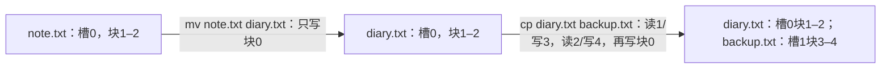

# 0024：文件重命名与复制

> 状态：**Spec Lock**（2026-10-05 18:22 +08:00）。项目所有者已批准整体方案并授权形成规格、继续实现。实现与本机验证完成，交付待维护者审查；学习与理解程度仍由项目所有者判断。

## INTENTION

把已有笔记改名、保存一份独立副本。两项作为同一文件管理能力交付，复制支持任意二进制文件，不受编辑器16KiB草稿上限约束。磁盘v1格式、Host后端、块协议、编辑器工作方式保持。

## SPEC

终端增加 `mv OLD NEW`、`cp SRC DEST`，按现有shell规则解析两个名称，额外参数或缺参数报普通用法错误，不进行文件操作；没有覆盖选项、路径或通配符。名字继续为1–31字节ASCII `[A-Za-z0-9._-]`，拒绝恰好`.`与`..`，区分大小写。确认输出为 `OK mv\r\n`、`OK cp\r\n`，错误复用已有ERROR格式和结果映射；仅FS成功后输出OK。help增加两命令。EDITING中的全部行继续交给editor，两条新命令在那里不会执行文件管理。

新增公开primitive：`yan_fs_rename(YanFs *, const char *old_name, const char *new_name)`、`yan_fs_copy(YanFs *, const char *source_name, const char *destination_name)`。不增加enum值或context整块缓存。名字实际读取范围含终止符不得与整个FS重叠，逐字节检查地址上界后再读取；两个只读名字可彼此重叠，包括指向同一字符串。调用者保证范围可访问且有效直到返回；不引入固定task身份。

两API的错误顺序固定为：context有效且已初始化→BUSY→FAULTED→MOUNTED→两个名称均有效→源存在→同名规则/目标已存在。两名称验证在查源前完成，因此不存在的源加非法目标返回INVALID。mv同名且源存在为OK、零I/O；源不存在仍NOT_FOUND。cp同名且源存在为EXISTS；源不存在仍NOT_FOUND。cp随后检查空目录槽，再检查连续空闲extent；同时目录满和空间不足返回DIRECTORY_FULL。mv不用新槽或新extent，即使目录满或磁盘满仍可改名。

mv在原物理槽中更新规范化name字段并重算CRC，只执行一次块0写入。size/start/count、其他目录槽与所有数据块字节保持。块0写成功后才发布metadata cache，故list物理槽顺序不变。自重命名不写metadata、不触发回调。

cp从当前metadata取得源size/start/count，保留源槽与extent，选择第一个空槽与低地址first-fit新连续extent。从源逐块读入已有4096字节scratch，再写对应目标块；末块超出size的字节清零。每个完整读成功后才写该目标块，所有数据写成功后从旧metadata重新构造候选目录到scratch，写一次块0并发布cache。空文件不读写数据，仅新增空文件目录项（size/start/count全0）并写一次metadata。复制需要额外完整extent，碎片可能NOSPACE，不借用源extent，不使用整文件buffer，也不通过嵌套公共read/create调用造成BUSY。

普通参数/名称/NOT_FOUND/EXISTS/DIRECTORY_FULL/NOSPACE失败没有任何设备I/O或写入，不发布缓存。数据读/写、metadata写实际失败或PROTOCOL沿0021停用实例，metadata cache保留最后成功目录；scratch不承诺保持。已写的新extent字节可能存在但没有目录引用，失败不承诺回滚。源数据不被本操作写入；若metadata写失败，磁盘目录可能旧、新或损坏，不能保证重新挂载后源仍可访问，不能把缓存未发布等同磁盘事务。恢复沿0020/0021重开Host进程，不自动修复。输出失败为致命，已成功改名/复制不回滚。

## 实际输入与块状态

16块镜像中，槽0的note.txt大小5000、extent1–2，其余槽空：

复制成功后两文件都为5000字节，块4的最后3192字节为零；后续改写backup.txt不影响diary.txt。若第二个数据读取失败，块3可能已写，目录仍未增加backup.txt，实例FAULTED；若最后块0失败，缓存仍旧但介质目录结果不保证。自重命名零I/O，复制到自身拒绝EXISTS，复制到既有其他名字也不覆盖。

## IMPLE PLAN

1. os/yanfs.h/.c与tests/test_yanfs.c：新增primitive及状态顺序、名字边界、slot/extent规则、逐块复制、尾零和失败cache发布测试；复用guard、名称扫描、first-fit、commit_metadata，保持busy直到回调全部完成。
2. os/shell.c/.h与tests/test_shell.c：两命令、help、arity、精确输出与FS结果映射；apps生产路由仅必要适配，原editor模式保持。任何输出阶段失败沿既有fatal。
3. 真实Guest验收：跨进程wholeimage oracle验证rename原槽/所有数据不变、copy独立extent及尾零、空文件、大于16KiB文件、满目录rename、相同名称和拒覆盖；编辑态输入mv/cp不执行FS。
4. 故障与门禁：源读/目标数据写/metadata写各阶段注入，回调重入BUSY，wholeFS cache及源数据oracle；新增具名变异绑定owner和具体断言，same-owner wrong-assert、PASS marker、duplicate、timeout/sanitizer/异常优先级永久负控。所有默认、ASan和相关实际变异以最终树为证，新增注册计数现测。
5. 总审核独立核SPEC/IMPLE/VERIFY、读者引用、MONITOR和cached，按整体能力提交。实现与独立审查分别记录证据，不提前宣称本能力通过。

## VERIFY

| 验收面 | 实际输入或状态 | 必须观察到的结果 |
| --- | --- | --- |
| 状态与参数顺序 | 未初始化、BUSY、FAULTED、未挂载同时给NULL或context别名名称；缺源+非法目标 | 既定状态优先；健康实例非法名称INVALID且零I/O |
| 名称与存在性 | 31/32字节、未终止、地址溢出、context头/尾、合法短名邻context；缺源/重名/同名 | 有界扫描、正确错误优先；mv存在源同名OK零I/O，cp同名EXISTS |
| rename原槽 | 5000字节、满63槽、满盘、目标更短/更长 | 单次块0写，原槽与size/extent保持，规范name尾零，所有数据字节不变 |
| copy分配 | 空文件、1/4096/4097字节、大于16KiB、碎片、目录满+无空间 | 第一空槽、低地址first-fit、源不变、新extent独立、尾零、目录满优先 |
| 发布顺序 | 记录每个源读/目标写及metadata写的callback | 数据全部成功才写块0；cache只在块0成功后发布 |
| 故障与重入 | 第一次/中间/最后数据读写、metadata写返回ERROR/PROTOCOL/未知值；回调重入 | FAULTED、cache旧、源数据未写，BUSY零额外I/O；不承诺介质回滚 |
| shell与编辑态 | arity、非法行、help、普通FS失败、EDITING输入mv/cp | 精确输出；普通错误继续；编辑态不执行两个primitive |
| 输出失败 | OK回执首/中/末字节失败 | 致命退出；已发布rename/copy保留，不回滚 |
| 真实Guest | 跨进程重挂、独立wholeimage及二进制oracle | 正确name/slot/extent/CRC/尾零；旧editor与终端能力回归 |
| 检测力 | rename改extent、同名多写、copy借源extent、漏尾零、提前发布、错误映射 | 指定owner+具体断言检出；无效输入、no-effect、wrong-assert、PASS marker、duplicate及harness异常永久负控 |

默认、ASan与实际变异结果按最终源码记录。缺仓库输入硬失败，缺外部依赖才按既定规则SKIP，不用timeout或崩溃冒充检出。新注册数量以实际CMake/CTest为准，旧能力测量不代替本能力VERIFY。

## 扩充关系与批准记录

本规格新增yan_fs_rename/yan_fs_copy与shell mv/cp。0021原文件API和0022八命令为对应阶段的锁定契约，其原文保留；0022当时“无rename”等范围说明由本阶段扩充，不回写历史结论。0023编辑模式继续保持，必须w成功或q退出后才回到shell执行mv/cp。磁盘version、Host/Guest块协议、错误enum、FS context与后端恢复规则不变。

项目所有者2026-10-05明确回答：“认可整体方案，形成规格并继续实现（推荐）”。批准涵盖两命令、拒覆盖、名称与错误顺序、rename同名零I/O和原槽、copy同名EXISTS及新槽新extent逐块二进制复制/尾零、空文件、数据完成后发布、普通错误保持及实际故障停用不回滚、编辑态隔离和协议格式不变。总审核据此锁定，批准与实现验收分别记录。

### 本机VERIFY结果（2026-10-05）

核心105例、shell89例、真实Guest14项和故障Guest16项通过；最终Linux Release默认49/49（19.29 s）、ASan/UBSan默认49/49（36.98 s），Windows MSVC默认29/29（2.27 s），十组实际变异10/10（97.01 s），均0失败、0SKIP。FS组19个、终端组24个实际缺陷均按指定owner和具体断言检出，0存活、0harness error。注册、完整结果与修正记录见 [STATUS](../STATUS.md)。BUILD_TESTING=OFF的生产构建及其ELF真实14项也通过。

native覆盖提交后回执首/中/末字节失败；真实Guest覆盖echo-boundary与回执中/末字节，物理首回执字节未单独注入。Guest I/O注入仅针对下一请求；协议错配覆盖copy响应3–7及rename目录响应，写后的错tag可能在介质上留下新目录或新数据，不能推导回滚。UINT32_MAX大小仅验证NOSPACE且无I/O，未实跑4GiB成功复制。Guest栈记录是单函数静态帧，不是完整调用链或中断嵌套水位证明。
