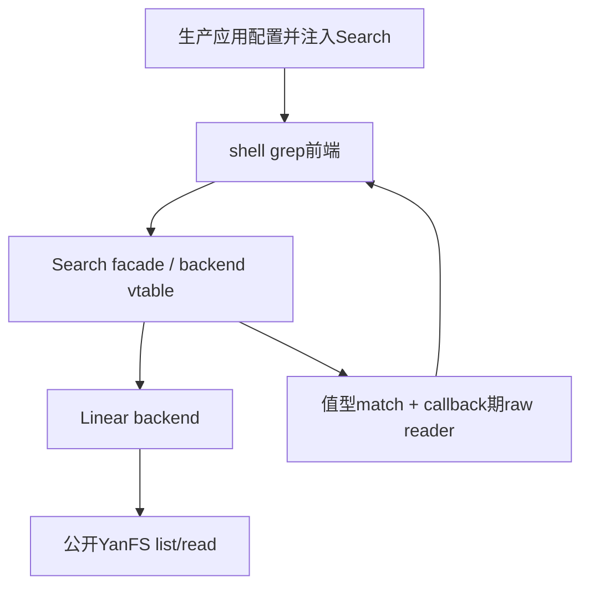

# 0025：知识检索基础设施

> 状态：**Spec Lock**（2026-10-06 13:10 +08:00）。项目所有者已批准整体方案并授权继续开发。实现与本机验证已完成，交付与远端CI待维护者审查；学习理解程度由项目所有者判断。具体enum、struct和函数名可在本行为范围内工程细化。

## INTENTION

从已保存的笔记检索关键词，建立统一Search API，由无索引线性backend先实现字面搜索。grep是终端前端，后续调用者可直接使用结构化结果；替换backend不要求shell重写搜索或解析终端文本。

原始文件始终是事实来源，未来索引属于可删除、可重建的派生数据。本阶段不引入索引、数据库、排名、snippet、分词、关联或语义搜索，不更改磁盘格式、ISA或运行时ABI。既有[文件系统](0021-yanfs.md)、[终端](0022-terminal-file-operations.md)、[编辑器](0023-multiline-text-editor.md)和[文件管理](0024-file-rename-copy.md)行为保持；这些阶段原文保留，本规格明确新扩充关系。

## SPEC

### grep语法

```text
grep TOKEN
grep "PATTERN WITH SPACES"
```

恰好一个非空PATTERN。裸形式为一个token，不含空格或双引号；裸token以`-`开头拒绝，quoted `"-i"`则查询字面`-i`。双引号形式只有一对外层双引号，内部字节及空格保持；不解释反斜线转义、变量或单引号，不允许内部双引号。命令前后空格沿既有shell，PATTERN后仅允许空格。

缺参数、空双引号、额外token、未闭引号或其它非法语法输出既有`ERROR USAGE\r\n`，不执行搜索或FS I/O。`grep " "`有效，查询一个空格。总命令行仍最多1023字节，超长与非法控制整行拒绝；无前导多余空格时裸pattern最多1018字节，quoted最多1016字节。现有读行器C0/DEL规则保持，grep不扩展输入控制字符。新语法只用于grep，既有命令不改变。

Search API接受独立的非空byte pattern，最多1023字节，只拒NUL和LF；TAB、裸CR、非法UTF-8及其它原始字节可由程序调用查询。CLI与API长度限制分别定义，不宣称CLI可键入1023字节pattern。按大小写敏感的精确byte子串匹配，不正则、不Unicode规范化、不stemming、不分词，不跨逻辑行匹配。

### 结果与行

按现有目录物理槽顺序、文件内1-based行号顺序发结果。同一行出现pattern多次仅发一个match。

```text
FILE:LINE:CONTENT\r\n
```

FILE为名字，LINE为十进制逻辑行号。CONTENT为完整匹配行的安全显示，不截断长行。LF分行，紧邻LF的CR构成CRLF终止符；终止符不属于内容或匹配。裸CR属于内容。跨chunk暂存CR，确定其为裸CR时才送入matcher；EOF末尾裸CR也参与。最后无LF的剩余内容参与匹配，空文件零行，末尾终止符不生成虚行。例如`A\nB`为两行，`A\n`一行，`\n`一空行。

匹配用原byte，展示沿0022 cat：反斜线双写，C0/DEL及UTF-8编码C1、非法/截断UTF-8逐byte `\xHH`，合法UTF-8可读，完整流式状态跨读取块保持。展示转义不改变文件或pattern，也不保证所有Unicode不可见字符安全。每结果输出自身CRLF，不裸发文件EOL。

成功包括零match，以`OK grep\r\n`结束；无结果不产生虚假FILE行、NOT_FOUND或数量摘要。不暴露跨文件累计u32序号/结果总计。EDITING模式全部行仍交editor，grep须w成功或q退出后在shell执行。

### 二进制策略与读取

每文件在任何match callback之前完整预检NUL。遇首个NUL即静默跳过整文件、零match，不读取其后字节；已实际发生的读取错误必须传播，不以binary skip掩盖。无NUL的非法UTF-8文件仍可byte搜索并安全显示。

无NUL文件预检后再流式扫描，定位匹配行后按其范围回读展示。因此是两次全文读取加匹配行按需重读，不承诺恰好读两遍。用4096字节scan缓冲与4096字节match reader缓冲，KMP前缀表最多1023个uint16项（2046字节），不缓存整个文件或行，不分配file-size内存，不继承editor16KiB容量；100KiB乃至FS可表示范围内的长行均不截断。全部大context长期静态或由调用者持有，不放4KiB任务栈。

aligned sequential扫描可避免512字节请求反复读取整FS块；match范围可能不对齐，4096字节read_match请求可能跨两个块。不对所有结果承诺固定I/O次数。精确context sizeof和Guest静态帧须实施后测量，约10KiB只是缓冲设计预算。

### 分层与生命周期



应用选择backend并建立长期Search与Linear context，`yan_shell_init`增加借用Search参数，同期适配所有既有调用者。shell仅解析grep、调用统一Search API及格式化结果；不实例化或选择linear，不遍历FS、不读取extent，也不由应用绕开shell处理grep。核心不依赖Console、shell展示或生产应用，测试可以注入另一backend与reader，证明替换backend不改变前端。

统一match提供值型文件名、行号及完整内容长度与受限opaque reader/capability；不提供任意长连续line指针，也不向shell暴露FS、slot或扫描过程。读取接口只访问当前match内容range，按relative offset和capacity分块返回raw字节及已读prefix。

match对象/reader仅同步callback期间合法，不能保留指针用于后续结果或查询。期外、越界、加法/地址溢出、输出与Search/FS重叠拒绝；调用者保证其它可访问范围，不声称能识别所有失效C指针。读当前match是query busy期间允许的特许入口，其自身不得重入；同Search query或init重入返回BUSY，无新增I/O。初始化地址/别名检查在读取bool状态前，Shell、Search、backend context、FS保持独立存储。pattern借用到query返回，期间不修改。

整个query（含预检、扫描、callback与match回读）期间，调用方不得修改、卸载、reinit/reopen借用的FS或镜像；其它task和输出callback同样遵守。它是稳定性前置条件，不是现有单API FS.busy强制整查询锁或快照。单owner生产应用满足此前提，不新增FS租约或运行时身份API；底层实际返回的错误仍传播，不静默跳过。

### 错误传播

统一结果区别成功、参数INVALID/BUSY、底层来源错误与callback STOPPED。枚举字段可工程细化，不能把FS故障归0match或普通取消。预检、扫描和match回读实际IO/PROTOCOL沿0021停用，FS来源结果向前端保留现有ERROR token及fatal映射；不增加恢复协议。callback主动停止与读取故障分开。

match reader读失败必须sticky记录，优先于callback返回后的STOPPED/OK，忽略reader结果也不能让query成功。输出sink失败立即fatal，停止所有后续读与输出，不再尝试诊断或OK。若内容已输出前缀而发生来源读错，输出仍健康时先CRLF隔离，再ERROR；隔离或诊断输出失败同样立即fatal。前面已显示的结果/内容不撤回，错误不声称完整结果集，失败无OK。

u32文件size/offset/line_length运算使用有界减法或宽算后检查，避免最后offset、CR位置及range加法回绕。UINT32_MAX个LF的极端文件最后有效行号仍可表示，不在最后LF后生成虚行或递增回绕。各文件行号重置，不累加成跨63文件u32编号。

## 实际状态例

目录槽0为`irq.md`内容`中断\r\n处理中断\n`，槽2为`binary`内容`中断\n…\0`。`grep 中断`先预检irq.md、再扫描两行，每行发一次match并通过Search reader回读；shell显示`irq.md:1:中断`、`irq.md:2:处理中断`及OK。binary首个NUL使全文件零match，即使NUL前已命中也不输出。搜索不写镜像。

若irq.md的match回读失败，已输出FILE前缀可以保留，CRLF+ERROR IO后终止，无OK；失败不是零结果。长行末尾才命中时，range reader从行首回读完整内容，固定缓冲不限制行长。

## IMPLE PLAN

1. 新增Search facade、backend vtable与Linear backend、公共header和native测试；先测试KMP、行/range、NUL预检、错误与callback生命周期再实现。通过公开FS访问，context静态持有。
2. shell新增grep grammar，注入Search并同期适配生产app和旧测试；复用cat安全展示helper，验证fake backend无FS仍可格式化，旧十命令及editor保持。
3. 真实生产Guest覆盖保存/edit/mv/cp后检索、中文跨块、长行、binary与只读wholeimage；验证生产BUILD_TESTING=OFF及RV32地址/offset边界。
4. 故障注入分别覆盖预检、scan、match回读及输出；记录源错误sticky和prefix隔离，不能以timeout/异常冒充检出。
5. 新实际mutant指定owner和具体断言，保留puregate分类器负控；严格/native/ASan/Windows/Guest/默认与actual依最终树实跑，新增注册数量现测。总审核核引用、MONITOR和cached；交付PR由维护者审查。

## VERIFY矩阵

| 面 | 实际输入/状态 | 预期 |
| --- | --- | --- |
| grammar | 空/空引号、多余token、未闭引号、裸-i、quoted-i、quoted空格、1018/1016极限 | 正确usage/字面查询，非法零I/O，总行超长整行拒绝 |
| byte matcher | 重复prefix、同一行多次、中文跨4096、pattern跨块、跨LF相似前缀 | 不丢匹配、不跨行、每行一次 |
| line | CRLF跨块、裸CR、空file/空行、末LF、无末LF、100KiB行 | 正确1-based行号、完整内容range、无虚行 |
| binary | 首/中/末NUL，NUL前命中，NUL后未读错误 | 全file零callback，NUL短路；已发生错误传播 |
| ordering/display | 目录空洞槽顺序，invalidUTF8/C1/TAB/backslash跨reader块 | slot/line排序，cat安全显示不改原字节 |
| API | fake backend、query/init重入、reader重入/期外/越界/alias、RV32地址与u32末offset | 统一前端、BUSY/INVALID且无多余I/O，range不回绕 |
| fault | 预检/scan/read_match读失败、忽略reader错误、sink首中末失败 | sticky来源错误、prefix隔离、fatal及时停止、无OK |
| persistence | 原文件含大于16KiB内容，搜索前后wholeimage、跨进程编辑后重查 | 无写入，原笔记决定结果，无索引依赖 |
| mutation | chunk重置、LF漏reset、CRLF/末行错、长行截断、lateNUL漏输出、重复emit、错误当成功、直FS绕backend | owner+具体断言；no-effect/wrong-owner/wrong-assert/PASS-marker/duplicate/harness异常控制 |

极值模拟与全规模执行分别记录，不把稀疏边界probe称为4GiB全文实跑。缺仓库source/script/header/ELF硬失败，真缺外部工具才按既定SKIP；变异副本失败不作为默认回归结论。

## 批准与后续

项目所有者2026-10-06对知识检索整体补足方案明确回答：“可以，继续开发”。总审核据此锁定上述语法、byte/line/NUL语义、完整长行与静态流式架构、Search注入及受限reader、稳定借用前提、sticky错误和输出契约。批准不表示实施或验证已经通过。

未来backend必须保留本literal任意byte语义与原文件内容；仅term postings不能声称等价替换。本阶段不实现任何未来索引、snippet、排名或语义路线。

## VERIFY执行记录（2026-10-07）

本机默认Release55/55（32.33 s）、ASan/UBSan55/55（50.93 s）、Windows32/32（5.70 s），十一组actual11/11（142.77 s），均0失败、0SKIP。核心92、shell122、真实Guest健康9与故障13、RV32实际tohost与标记探针、BUILD_TESTING=OFF生产ELF健康9项通过。新Search17个actual缺陷命中指定owner和断言，三个真实归因控制及pure控制符合预期；完整日志、失败历史与验证边界见[STATUS知识检索验收](../STATUS.md)。上述记录不改变锁定行为、批准时间或稳定借用前提，也不表示维护者合入批准。
